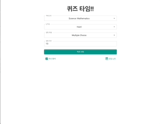

# Quiz-app

    

> Open Trivia API를 이용한 퀴즈 앱 만들기

## 주소

- 사이트: https://adc0612-quizapp.netlify.app/
- 벡엔드 서버: https://opentdb.com/api_config.php

## 기능

- 퀴즈 option 선택 후 퀴즈 풀기 (선택 안 할시 default값으로 퀴즈 실행)
- 유저가 답 클릭시 정답 / 오답 표시
- 퀴즈 종료 후 소요시간 및 점수 표시
- 정답/오답 비율과 퀴즈기록이 있는 통계 제공
- 오답노트 제공

## 구현 사항

- [x] '퀴즈 풀기' 버튼을 클릭하여 퀴즈 풀기를 시작할 수 있다.
- [x] 사용자는 문항에 대한 답안을 4개 보기 중에 선택할 수 있다.
- [x] 사용자는 답안을 선택하면 다음 문항을 볼 수 있다.
  - [x] 답안 선택 후 다음 문항 버튼을 볼 수 있다.
  - [x] 답안이 맞았는지 틀렸는지 바로 알 수 있다.
  - [x] 다음 문항 버튼을 클릭하여 다음 문항으로 이동할 수 있다.
- [x] 모든 문항을 다 풀면 사용자는 다음과 같은 결과 정보를 볼 수 있다.
  - [x] 퀴즈를 마칠 때까지 소요된 시간
  - [x] 정답 개수
  - [x] 오답 수
- [x] 정 오답에 대한 비율을 차트로 표기
- [x] 다시 풀기
- [x] 오답 노트
- [ ] 컴포넌트 테스트

## 사용된 기술스택

- React
- JavaScript
- react-router-dom (router 구성)
- Recoil (상태 관리)
- MUI (UI 구성)
- Chart.js (차트 구성)
- moment (시간 계산)
- localStorage (퀴즈 기록 저장)
